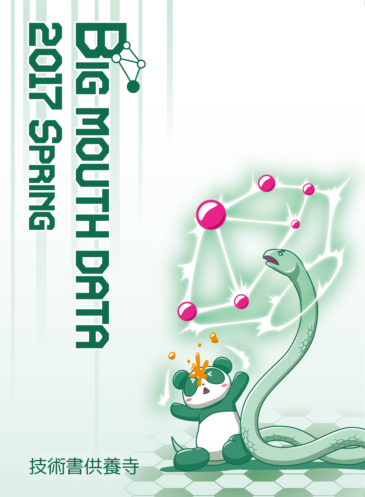

# 技術書供養寺

## Big Mouth Data 2017 Spring

[技術書典2](https://techbookfest.org/event/tbf02) お-13で頒布します。

### 目次
- 機械学習初学者向けのポエム(@chezou)
  - 機械学習プロジェクトのはじめ方
  - 機械学習で何ができる？
  - システムに機械学習を組み込む
  - 学習のためのリソースを収集しよう
  - 映画の推薦システムをつくる
- KickStarterを雑に分析してみよう(@tokoroten)
- ゲームの勝敗結果のマイニング(@hagino3000)
